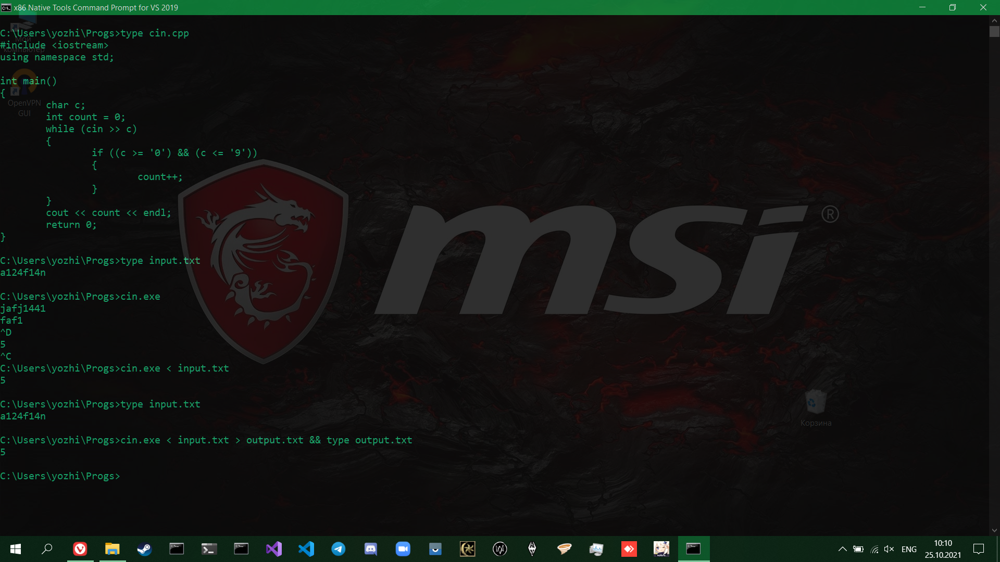

# CLI Culture
## Командная строка в Windows 10 и Visual Studio
Первое, с чем предстоит справиться при работе с CMD, это найти нужную. Для этого в поиске по системе можно набрать CMD и выбрать какую-нибудь, которая содержит в названии VS
<br></br>
</img>

Далее вводим ```help``` и читаем справку по командам. В первую очередь нам нужны ```CD``` и ```DIR```. Первая позволяет перемещаться между папками, вторая выводит содержимое папок. Чтобы передать команде дополнительные опции, надо после неё указать слэш и букву после него. Так, /D заставляет CD перемещаться между дисками (у меня на машине есть C и D, иногда бывает F, но чтобы переключиться между любыми из них, нужен флаг /D). Чтобы посмотреть справку по конкретной команде и все её опции, надо набрать ```COMMAND /?```. Ниже представлены примеры работы команд CD и DIR (для написания системных команд, которые есть в ```help```, регистр не важен)
<br></br>
</img>
Стоит также обратить внимание на команду ```type```, она печатает в консоль содержимое файла
<br></br>
</img>
Теперь мы вплотную подошли вопросу, как это может помочь с программированием на С++.
## Сборка программ
Переходим в какую-нибудь рабочую папку, например, в ту, где Visual Studio хранит ваш текущий проект, или любую другую по желанию. Находим там или создаём файл с окончанием .cpp. По умолчанию можно использовать блокнот, ибо он всегда есть на винде, можно писать код в VS, можно в любом другом текстовом редакторе. Если путь до исполняемого файла этого редактора есть в ```PATH``` (тоже команда, всем стоит посмотреть на её вывод), то его тоже можно вызвать из консоли. Так, у меня есть notepad, atom и code, и ещё я очень уважаю sublime text. Здесь для простоты использован блокнот
<br></br>
</img>
Далее на исходный код нужно натравить компилятор. Поскольку мы работаем в VS-овской командной строке, у нас есть компилятор ```cl```. Набираем ```cl /?```
<br></br>
</img>
Видим длинную справку, если интересно, читаем дальше. Если нет, то жмём ```CTRL-C```.
Компилируем нашу программу ```cl /Wall some_prog.cpp``` (опция ```/Wall``` включает все предупреждения, которые мог бы выдать компилятор)
<br></br>
</img>
Тут мы видим, что не определены cout и endl - вероятно, потому, что я не указал пространство имён. Исправляем:
<br></br>
</img>
Компилятор выдал множество ворнингов, не имеющих отношения к делу, так что пересобрали без дополнительных предупреждений ```cl some_prog.cpp```. Замечаем, что собралось успешно, и на выходе получился файл some_prog.exe
<br></br>
</img>
Запускаем:
<br></br>
</img>
## Перенаправление ввода из файла
Иногда бывает лень раз за разом вводить что-то от руки, поэтому можно занести это что-то в файл, который потом подавать на вход программе. В следующем примере программа читает символы по одному, пока они вводятся, и пересчитывает количество цифр в них. Если вбивать от руки, ввод не прекращается (на линуксе бы прекратился при вводе ^D или CTRL-D), но если подать на вход файл input.txt, все отработает так, как мы хотим. Для этого пишем наш экзешник, затем треугольную скобку влево, после которой ставим входной файл. Можно также перенаправить вывод программы не на экран, а в файл. Тогда мы пишем треугольную скобку в другую сторону, потом указываем выходной файл. Если его нет, он создастся. После двух амперсандов можно указать следующую команду (их так можно навешивать сколько угодно)
<br></br>
</img>
## Дополнение
В этом дополнении речь пойдёт про автодополнение. На линуксе оно срабатывает и на команды тоже, а на винде только для навигации по папкам и файлам. На обеих ОС оно осуществляется с помощью кнопки TAB. Таким образом, если у вас в папке лежит файл some_prog.cpp, и он один на букву s там, то можно ввести s, затем TAB, и сработает автодополнение. Если лежат some_prog.cpp и какой-нибудь some_prog.exe, то сначала покажется первый, но можно табнуть ещё раз, и покажется следующий
